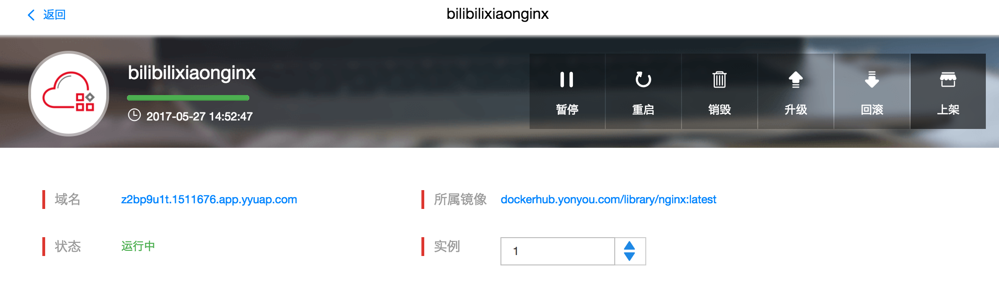
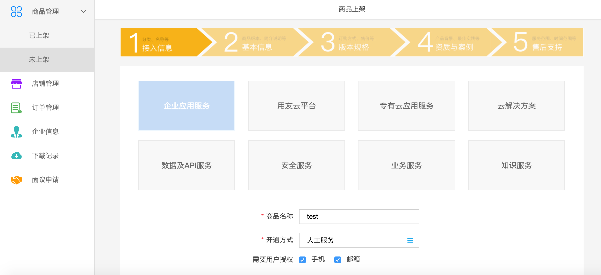
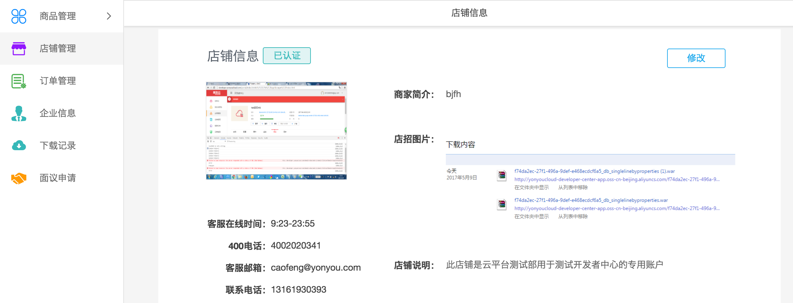

## 应用上架

开发中中心提供了应用从上传，部署到上架的一站式流程。对于已部署的应用，可以直接接入云市场发布上架，供用户购买使用。 

上架步骤如下：

1. 点击左侧“应用管理”菜单，进入应用卡片列表页面，点击具体卡片，进入应用详情页

2. 应用详情页上方工具栏点击“上架”按钮，页面跳转到云市场的产品发布向导页，用户可按照提示进行应用上架操作。

> 要注意的是：
> 
> 1. 用户账号必须要申请成为isv（服务商），并在云市场中装修店铺并审核通过后才可以上架应用
> 2. 必须是已部署的应用，并且有实例正常运行的情况下才可以申请上架。
> 3. 进入产品上架向导页后，若没有完成向导，云市场会保存编辑状态，下一次同样产品申请上架时，会接着上次发布状态继续编辑上架。

