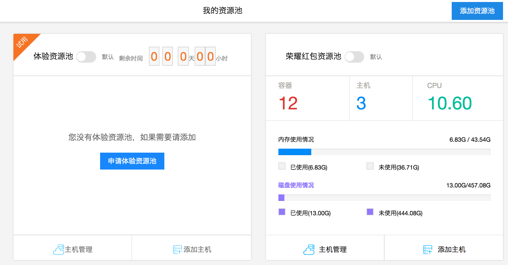
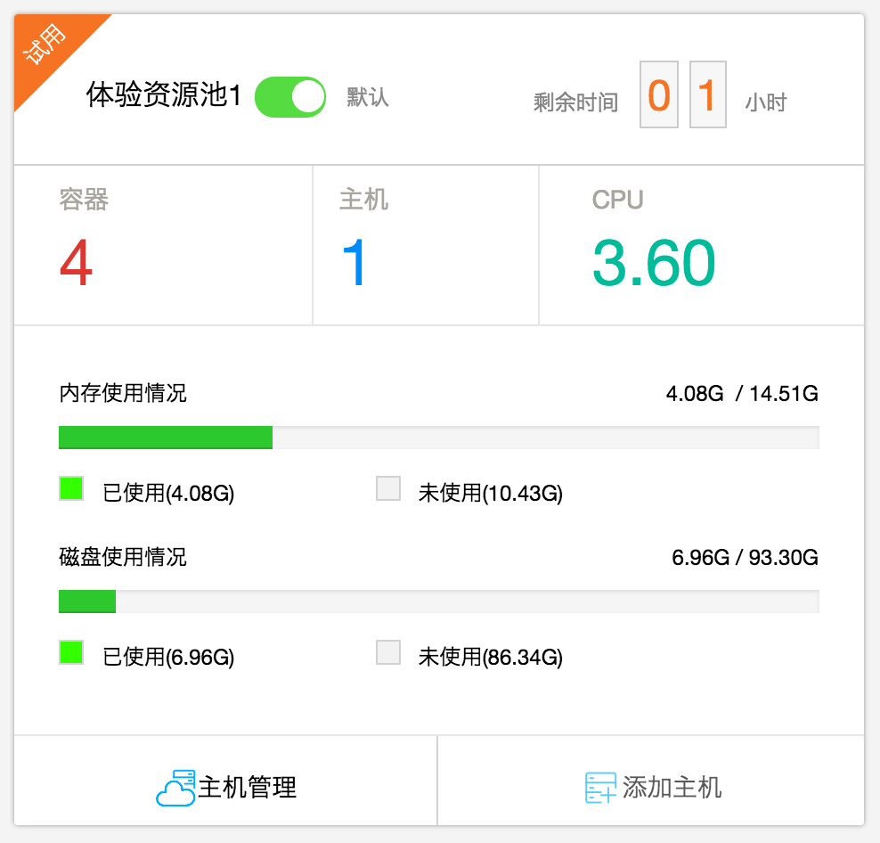
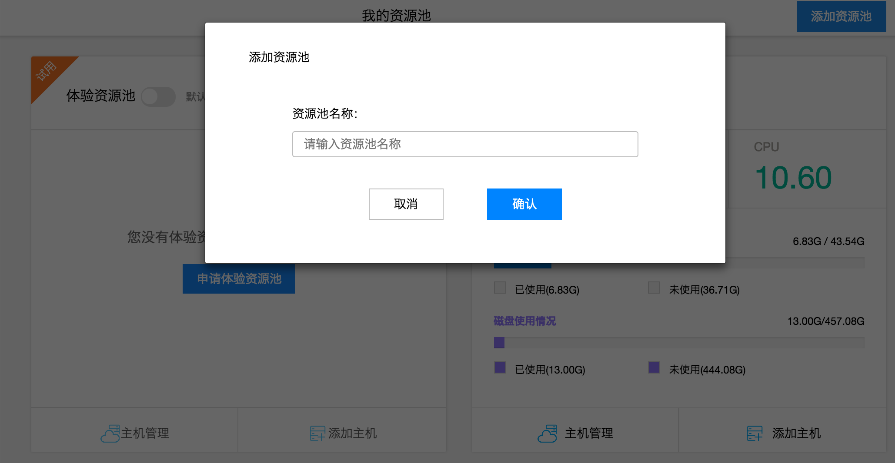
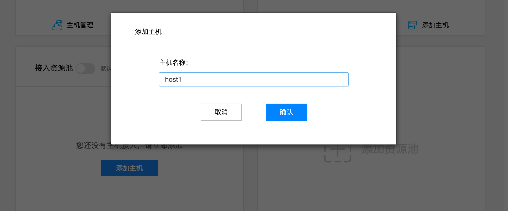
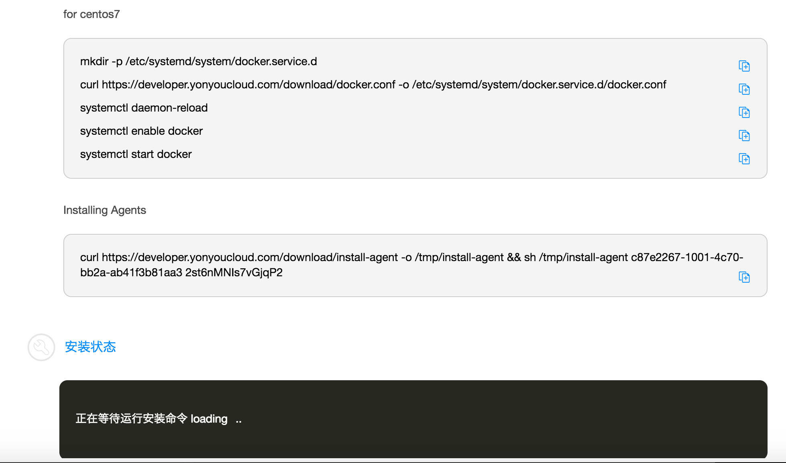
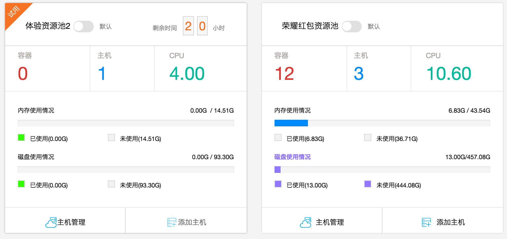
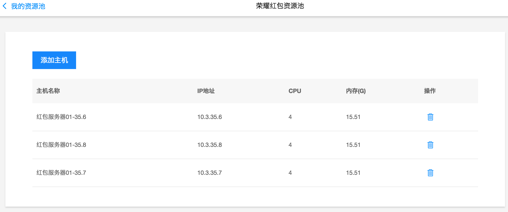

## 体验资源池与自有资源池

### 资源池
资源池，是 用友云开发者中心平台上资源的结合，是为用户提供了统一管理计算资源的一种方式。

资源池是一个逻辑概念，您可以创建自有资源池，并向资源池中添加属于自己的主机。集群用来区分不同目的的资源和应用交付目的地。

使用容器化软件交付，在完成镜像构建后，我们可以非常方便的把一个或者一组镜像部署到不同的资源池之上，用于不同的交付目的。

### 体验资源池
初次体验开发者中心的您，如果没有一台可用的linux主机或者没有购买云主机，我们邀请您申请体验资源池进行试用。

步骤如下：

1. 在控制台点击“我的资源池”，在右侧页面体验资源池点击“申请体验资源池”
2. 在出现的邀请码输入页面输入邀请码申请体验资源池，若没有邀请码，请点击“去申请”按钮
3. 申请邀请码页面输入用户信息，点击提交申请
4. 管理员审批通过后，用户通过预留的手机或邮箱可收到邀请码，输入邀请码即可分配一个体验资源池
5. 体验资源池申请成功后，即可体验开发者中心的所有功能，要注意的是，考虑资源的合理利用，体验资源池至于24小时的试用期，24小时后，体验资源池将会被回收，资源池内启动的应用将被销毁

### 自有资源池
您可以通过“添加资源池”功能新建自有资源池，将私有主机或者云主机接入资源池。

步骤如下：

1. 在“我的资源池”界面，点击右上角“添加资源池”按钮
2. 输入资源池的名称，点击确定，等待几秒后，即可看到新建的自有资源池

3. 在创建的自有资源池卡片中点击“添加主机”按钮，输入主机名称,确定后进入接入脚本页面

4. ssh进入要接入的linux主机，在命令行中输入接入脚本页面的shell脚本，即可自动安装接入脚本，安装状态栏显示“安装成功”后，主机完成接入

主机接入前请确保:

1. 已连接至互联网。
2. 使用官方支持的linux版本。

### 资源池管理
申请了体验资源池或者在自有资源池中添加了自有主机后，您就可以开始管理您的资源池了

1. 每个资源池在“我的资源池”页面中表现为一个卡片页，卡片中列出了资源池的名称，资源池类型，运行的容器数，主机数，cpu核数，内存和磁盘使用情况，体验资源池还会显示剩余租期，提示用户及时处理。
2. 卡片中点击“主机管理”按钮，进入资源池的主机列表页面，可以方便的看到资源池主机的信息，并可以添加以及删除主机

3. 卡片点击右上角的编辑按钮，可以对资源池名称进行编辑，点击删除按钮，可以删除资源池及其内部的主机。 

