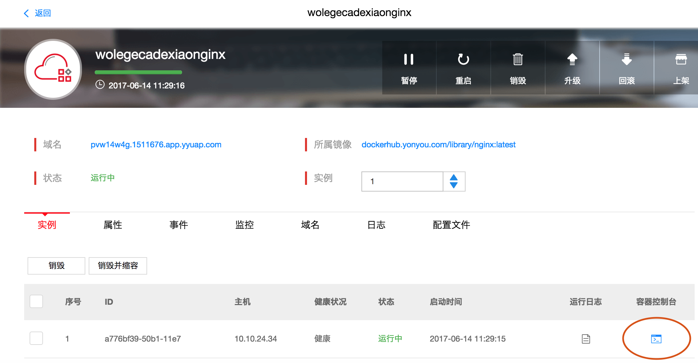
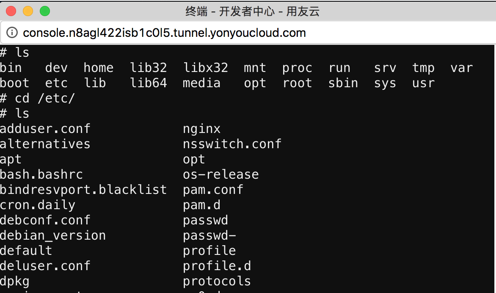

## 在线终端

我们提供了在线的命令行终端为用户解决了容器动态调整的问题。用户可以通过应用详情页进入容器控制台，进入容器内部进行高级操作。 

步骤如下：

1. 点击左侧菜单栏“应用管理”，进入应用卡片列表页面
2. 点击要操作的应用卡片，进入应用详情页
3. 在应用详情页的“实例”页签中，找到要操作容器的实例条目，点击条目左侧的容器控制台图标，进入在线终端

4. 在打开的终端窗口中可以对容器进行自由的操作。 

